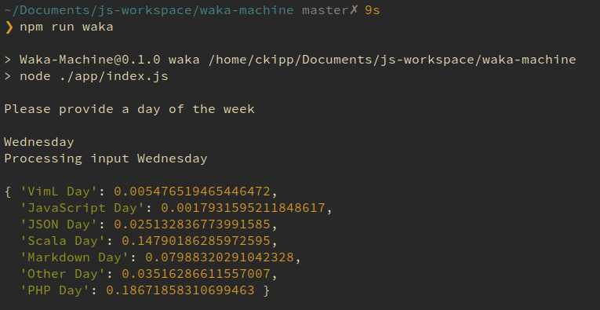

# waka-machine

_This is a work in progress_

Waka-machine is a machine learning attempt to see what my day will consist of as I start it such as languages that I'll be using, operating systems, and other patterns.

This will eventually be utilized by the [ándaga-core](https://github.com/ckipp01/andaga-core) and part of the [chronica](https://chronica.xyz) ecosystem.

The projects utilizes the [brain.js neural network](https://github.com/BrainJS/brain.js) and the [wakatime api](https://wakatime.com/developers) to gather training data.

### TODO

- [x] Gather training data
- [x] Get initial output with training data
- [x] Test coverage of all exposed utilities _in progress_
- [ ] Integrate with [ándaga-core](https://github.com/ckipp01/andaga-core)
- [ ] Add functionality to retrain the neural network at night after I get another day of data
